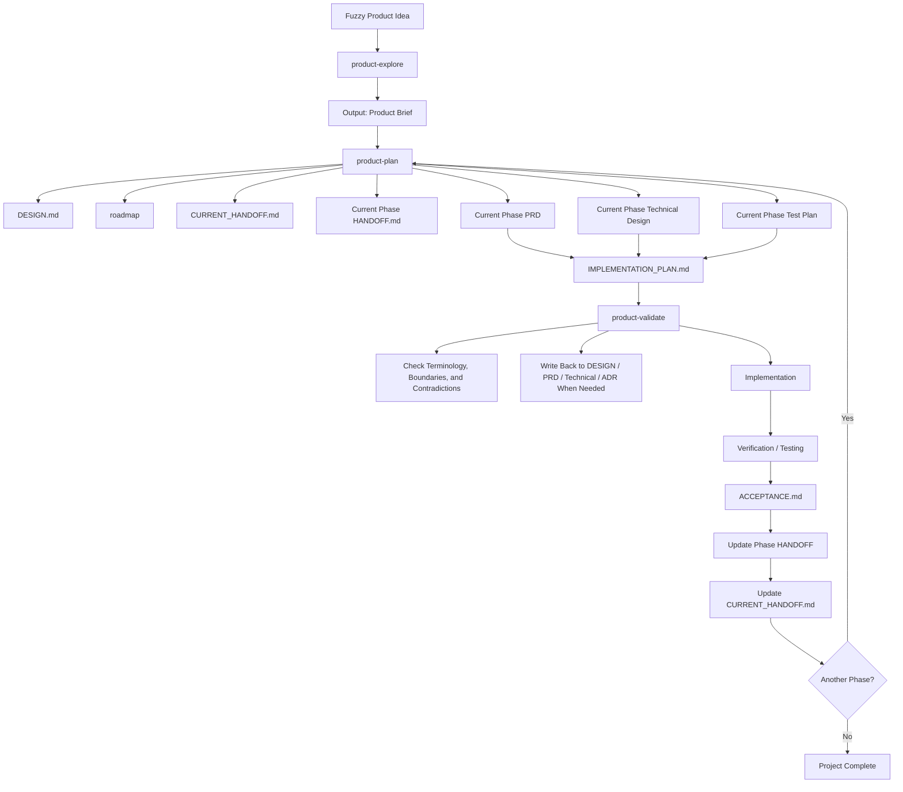
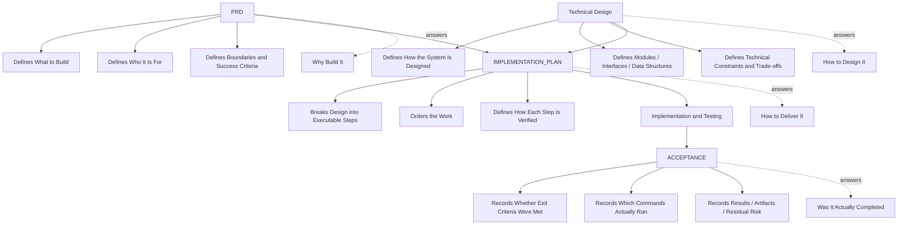
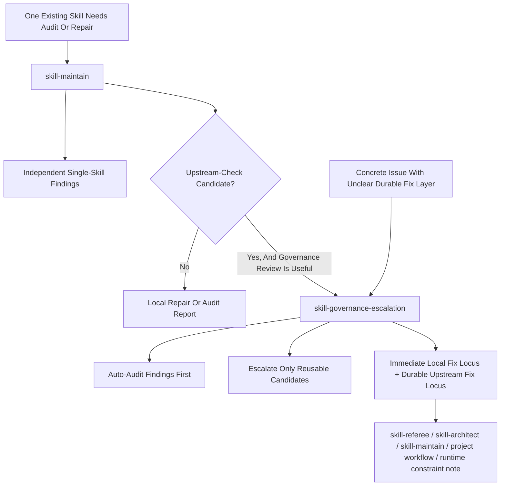

# Skills

Personal agent skills that I use and maintain publicly.

These skills are designed to be small, composable, and easy to install into different agent skill directories. The repository is the source of truth; local agent skill folders can symlink to the skills here so there is only one maintained copy.

## Skills

- [`product-explore`](./skills/product-explore/SKILL.md): Explores a fuzzy product or feature idea, clarifies the real problem and users, and converges on a Product Brief before planning.
- [`product-plan`](./skills/product-plan/SKILL.md): Builds and maintains durable product context, planning docs, phase handoffs, and evidence for multi-phase product work.
- [`product-validate`](./skills/product-validate/SKILL.md): Stress-tests an existing product plan against docs, terminology, code, and decision boundaries before execution or replanning continues.
- [`skill-governance-escalation`](./skills/skill-governance-escalation/SKILL.md): Explicitly auto-audits a concrete issue first, then escalates only the findings that suggest reusable upstream causes.
- [`skill-referee`](./skills/skill-referee/SKILL.md): Referees responsibility boundaries between skills across any domain, using metadata-first discovery and controlled review depth.
- [`skill-architect`](./skills/skill-architect/SKILL.md): Designs mature, token-efficient skills with explicit authority boundaries, output contracts, interaction intensity, references, scripts, assets, validation, and bundle structure.
- [`skill-maintain`](./skills/skill-maintain/SKILL.md): Audits and repairs one existing skill through modular checks for portability, language consistency, output contracts, interaction intensity, bundle integrity, authority boundaries, structure, routing, companion format-file opportunities, and token/context cost without taking over multi-skill boundary design.

## Product Workflow

`product-explore -> product-plan -> product-validate -> implementation`



These three product-oriented skills should connect through artifact contracts, not through vague intuition:

- `product-explore`
  - Use when the idea is still fuzzy.
  - Output: `Product Brief`.
  - Does not directly mutate execution-state documents such as `CURRENT_HANDOFF.md`.
- `product-plan`
  - Use when the direction is clear enough to become durable planning context.
  - Output: the planning stack for serious multi-phase work, centered on `DESIGN.md`, roadmap, current handoff, phase handoffs, PRDs, technical designs, test plans, `IMPLEMENTATION_PLAN.md`, and `ACCEPTANCE.md`.
  - Treats `Product Brief` as upstream input, not as current execution state.
- `product-validate`
  - Use after planning and before implementation, or before a major replan.
  - Challenges the plan against existing docs, code, terminology, and decision boundaries.
  - Can propose document repairs and ADR-worthy decisions, but does not directly take over current-phase execution state.

The most common path is:

1. Explore the product idea until it becomes a usable `Product Brief`
2. Turn that brief into durable planning documents
3. Use `product-validate` to challenge terminology, code, and decision boundaries
4. Hand off to implementation only after the plan is coherent enough

### Document Layers

`product-plan` uses a layered document model. The key distinction is not "one folder per phase" versus "one folder per document type", but **which layer owns which kind of truth**.

- `DESIGN.md`
  - Holds durable product judgment and long-lived design direction.
  - Best kept at the repository root so it remains visibly distinct from phase and reference docs.
- `docs/roadmap/PROJECT_DEVELOPMENT_PLAN.md`
  - Holds phase sequence, exit conditions, and prerequisites.
- `docs/context/CURRENT_HANDOFF.md`
  - Holds current execution state: active phase, active branch, next work, and verification commands.
- `docs/phases/phase-XX-<slug>/HANDOFF.md`
  - Holds operational handoff information for one phase.
- `docs/prd/`, `docs/technical/`, `docs/testing/`
  - Hold phase requirements, architecture contracts, and test strategy.
- `docs/phases/phase-XX-<slug>/IMPLEMENTATION_PLAN.md`
  - Holds execution slicing and delivery order for the current phase. It is not a second technical design.
- `docs/phases/phase-XX-<slug>/ACCEPTANCE.md`
  - Holds phase-close evidence: commands, results, artifacts, commits, and residual risk.
- `docs/adr/`
  - Holds cross-phase decisions worth preserving long term.

The usual planning-document build order is:

1. `DESIGN.md`
2. roadmap
3. Runtime entrypoint such as `AGENTS.md` or `CLAUDE.md`
4. `docs/context/CURRENT_HANDOFF.md`
5. Current phase `HANDOFF.md`
6. Current phase PRD, technical design, and test plan
7. Current phase `IMPLEMENTATION_PLAN.md`
8. Current phase `ACCEPTANCE.md`

Future phases should usually stay coarse in the roadmap until they are close enough to implement. Unless there is a strong reason, do not fully write every future phase PRD, technical design, and implementation plan up front.



## Skill Workflow

`skill-maintain` handles independent single-skill audit and repair. `skill-governance-escalation` handles auto-audit plus optional upward recursion when a concrete issue may have a reusable upstream cause.



These governance skills solve different layers of the same problem:

- `skill-governance-escalation`
  - Use when a concrete issue should trigger an explicit governance review.
  - Output: findings, layer classification, abstract failure mode, escalation judgment, immediate local fix locus, durable upstream fix locus, and routing guidance.
  - It auto-audits first, then escalates only the findings that warrant reusable upstream repair.

- `skill-referee`
  - Use when multiple skills may overlap, conflict, trigger too broadly, or need clearer routing.
  - Output: clearer boundaries, routing guidance, and conflict classification.
  - Best used before redesigning one specific skill when the real uncertainty is still between skills.
- `skill-architect`
  - Use when the boundary is already clear and the remaining question is how one skill should be shaped.
  - Output: a stronger skill design or implementation plan covering authority boundaries, output contracts, interaction model, references, scripts, assets, validation, and bundle structure.
  - This is the right place to decide whether a repeated artifact deserves a companion format file.
- `skill-maintain`
  - Use when one existing skill already exists and needs an audit or repair.
  - Output: focused repairs for portability, structure, routing, output contracts, safety, bundle consistency, format-file opportunities, format-file quality, or token cost.
  - It stays independently usable even if `skill-governance-escalation` is unavailable in the current environment.
  - This is not the right tool for deciding whether multiple skills should be split, merged, or rerouted from scratch.

The most common skill-management paths are:

1. If one existing skill already needs an audit or repair, use `skill-maintain`.
2. If that audit reveals a suspected reusable upstream cause, optionally escalate with `skill-governance-escalation`.
3. If the real problem is boundary confusion between skills, use `skill-referee`.
4. Once one skill's boundary is clear, use `skill-architect` to design or redesign the right shape.

### Companion Format Files

Many mature skills use companion format files in `references/` for repeated high-value artifact shapes such as product briefs, handoffs, acceptance evidence, or ADRs.

The rule of thumb is:

- use `skill-architect` to decide whether a format file should exist
- use `skill-maintain` to check whether a format file is missing, bloated, vague, ritualized, or drifted from the parent skill

High-quality format files should stay short, define when to use them, define when not to use them, distinguish required structure from optional detail, and stay aligned with the parent skill's artifact contract.

## Install

Clone this repository:

```bash
git clone git@github.com:ccomma/skills.git
cd skills
```

Install to a specific skill directory:

```bash
./scripts/install.sh --target ~/.agents/skills
./scripts/install.sh --target ~/.claude/skills
./scripts/install.sh --target ~/.cc-switch/skills
```

Install by profile:

```bash
./scripts/install.sh --profile codex
./scripts/install.sh --profile claude
./scripts/install.sh --profile cc-switch
```

Default install uses the Codex-style target:

```bash
./scripts/install.sh
```

Install to every known target directory that already exists on this machine:

```bash
./scripts/install.sh --all
```

The installer creates symlinks from the target skill directory to this repository. It does not overwrite existing non-symlink skill directories. If a target already has one of these skills as a real directory, back it up or remove it before installing.

## Maintenance

Edit skills in this repository:

```text
skills/<skill-name>/SKILL.md
skills/<skill-name>/references/
skills/<skill-name>/agents/openai.yaml
skills/<skill-name>/scripts/
```

`agents/openai.yaml` is optional, but when present it should stay aligned with the skill name, display name, and default prompt.

Many skills also use companion format files in `references/` for repeated artifact shapes such as product briefs, handoffs, acceptance evidence, or ADRs. Keep those format files short, explicit about when to use them, and aligned with the parent skill's artifact contract.

Use the deterministic bundle checker when a skill is renamed, restructured, or given new references, scripts, or format files:

```bash
./skills/skill-maintain/scripts/check-skill-bundle.sh ./skills/<skill-name> --expected-name <skill-name>
./skills/skill-maintain/scripts/check-skill-bundle.sh ./skills/<skill-name> --expected-name <skill-name> --policy internal
```

The default `external` policy is suitable for third-party or imported skills. The `internal` policy is stricter and is intended for the skills maintained in this repository.

When installed through symlinks, your local agent runtime reads the same files from this repository, so public maintenance and personal usage do not drift apart.

## Safety

`scripts/install.sh` only writes to the selected target directory. It does not automatically modify `~/.agents/skills`, `~/.cc-switch/skills`, or any other agent folder unless you explicitly choose that target/profile.

## License

MIT
